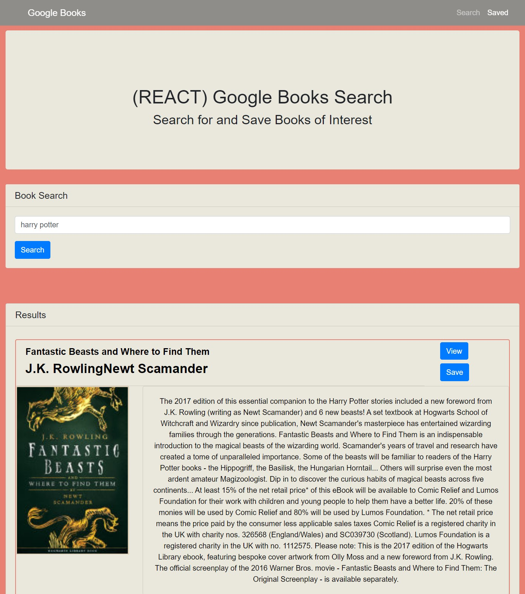

# Google-Books-Search
Google Books Search - Week 21 Homework

# Motivation 
This homework will provide a single page application that provides the ability to search, view, save, and delete books using the Google Books api. It will allow practice in writing code using the ReactJs library as welll as server functionality using express router.

# Code Style
This project is written using HTML and CSS Bootstrap framework as well as the ReactJs Javascript library. Mongoose is used for storing the saved data on the server and returning data to the front end.

# Screenshots


Search Page





Saved Page


# Features
The results section on both pages is loaded only when the state tracking API results has data returned. Additionally, results are generated from a reusable component including functions to handle saving results and deleting saved books.

# Code Example
This code section handles the submission of the search to the Google API and trims spaces from the input box to be replaced with + symbols.

  ```javascript
  handleFormSubmit = (event) => {
    event.preventDefault();
    API.bookSearch(this.state.search.split(" ").join("+"))
      .then((res) => {
        if (res.data.status === "error") {
          throw new Error(res.data.message);
        }
        this.setState({ results: res.data.items, error: "" });
        this.setState({ search: "" });
      })
      .catch((err) => this.setState({ error: err.message }));
  };
  ```
This code section waits until after the saved page mounts and then makes an API call to the MongoDB server to populate the saved results.

  ```javascript
  componentDidMount() {
    this.loadSavedBooks();
  }

  loadSavedBooks= () => {
    API.bookLoad()
      .then(res =>{
        console.log(res)
        this.setState({
          results: res.data
        })
        console.log(this.state.results)
       })
      .catch(err => console.log(err));
  };
  ```
# How to Use
Books can be searched for on the Search page. Results populated can be further viewed or saved for later reference. Results on the saved page can also be viewed or deleted.